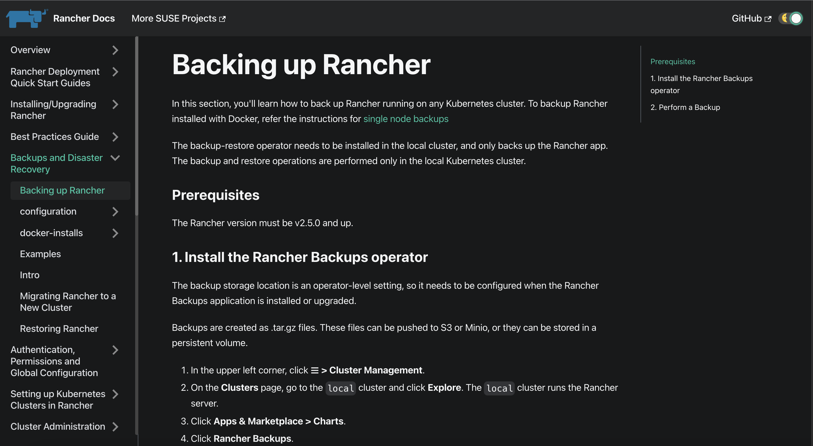

# Website

This project is intended to create a proof of concept for the Rancher documentation with Docusaurus.

This website is built using [Docusaurus 2](https://docusaurus.io/), a modern static website generator.

Also see the relevant Confluence page on [docs migration planning.](https://confluence.suse.com/display/EN/Docs+Migration+Planning)

Note that the navigation is messed up because in Docusaurus, you don't have landing pages and front matter or nav configuration files need to be updated to specify how the links appear in the left nav.

# Screenshots

Light theme:


Dark theme:



# Unfinished Manual Conversion Steps

When I made a Docusaurus mockup, I made a list of manual changes that would be required to make the Rancher docs work properly in the new theme. It would be a lot.

Because these migration steps could take weeks (not just docusaurus, but any other platform would also have manual migration steps), I think the theme change should come first, and the git-branch-based docs versions should come later. Because if the migration to the new theme takes a long time, the content could get too far out of sync with master. Whereas we have plenty of time to set up git-based docs branches.

- creating `_category_json` files to replace landing pages

- because the left nav in Docusaurus uses categories instead of landing page, we would need to delete landing page content when it’s unimportant, and create child pages out of it when the content is important

- converting images - images need to be stored locally next to the page they are in

- updating tabs and notes to use Docusaurus components

- updating or deleting accordions

- setting up versions using the CLI that comes with Docusaurus

- setting up Algolia search with an api key

- all HTML elements, including things like `<a>` and `<figcaption>`, would need to be replaced. All angle brackets would need to be either removed or escaped with `\`

- remove manual TOCs

- would want to change many level 1 headings to level 2 whenever they are not at the top of a page. The level 1 headings don’t look right in the middle and they aren’t included in the auto-generated TOCs.

- change most level 3 headings to level 2, because all our pages have two levels of headings at most

- Some level 3 headings should also be level 2, when they are the only ones on the page

- review all pages for formatting errors post conversion

- change the ‘edit this page’ link in the footer

- update front matter

- replace weight property with position

- move images to be located next to the files they are linked to in, which is a better way than how we currently do it. In our Hugo site, all the images are separated out into an images folder at the root directory, so some images aren't being used anymore, and it’s hard to see what’s not needed anymore


# Notes on Docusaurus

- Broken link detection is enabled by default when you build the Docusaurus site, which is useful

- It integrates with Algolia search, and there is a built-in option to limit search results to certain docs versions, which we will need. (`contextualSearch: true`)

- No need for manual TOCs for individual pages because it's all auto-generated

- It has a built-in copy button for code blocks, which is an often-requested feature.

- It offers tabs for commands in different languages

- It easily deploys on GitHub pages with one command

- There is a command line option to publish a new docs version (these aren’t git branches though; they just create a directory in the versioned docs folder)


### Installation

```
$ yarn
```

### Local Development

```
$ yarn start
```

This command starts a local development server and opens up a browser window. Most changes are reflected live without having to restart the server.

### Build

```
$ yarn build
```

This command generates static content into the `build` directory and can be served using any static contents hosting service.

### Deployment

```
$ GIT_USER=<Your GitHub username> USE_SSH=true yarn deploy
```

If you are using GitHub pages for hosting, this command is a convenient way to build the website and push to the `gh-pages` branch.
